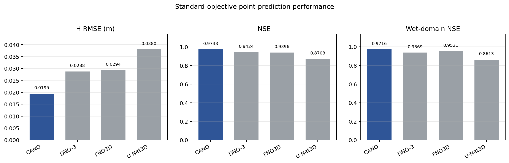
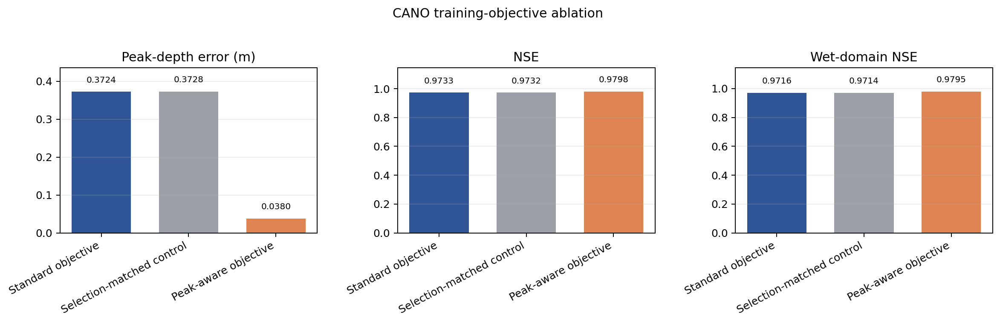
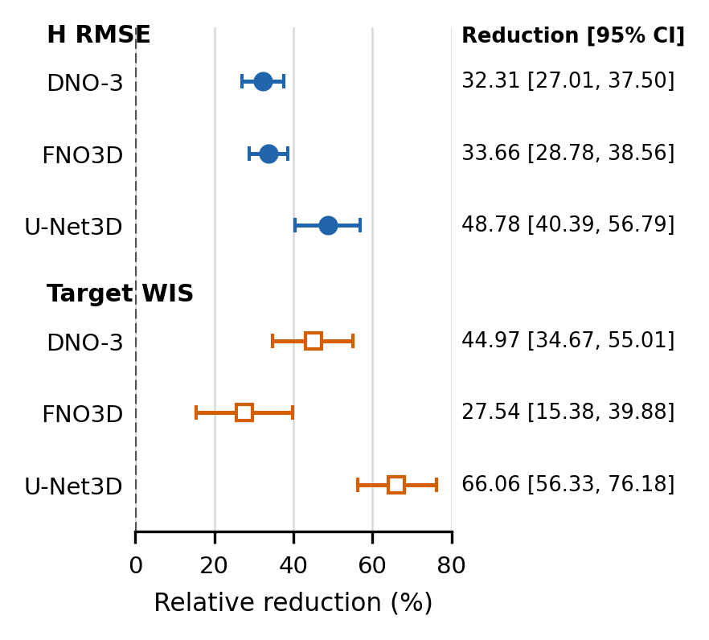

# CANO: Coverage-Aware Neural Operator

[English](README.md)

CANO는 도시 침수 물리장 예측을 위한 좌표질의 신경 연산자입니다. 이
저장소는 IEEE BigData 2026 투고 논문의 재현성을 지원하기 위해 다음을
공개합니다.

- CANO 모델과 논문에서 사용한 설정
- 공통 학습·평가 코드
- 노드 정규화 운영대상 정렬 보정과 사건 단위 evidence API
- 원 저자 DNO-3·FNO3D·U-Net3D 코드용 adapter
- 논문 표의 집계 결과와 익명화한 사건별 결과
- 표와 그래프를 다시 만드는 간단한 명령어

데이터셋, 체크포인트, 대용량 예측 배열은 포함하지 않습니다.

## 5분 시작

```bash
git clone https://github.com/luvpool0811/CANO-BigData2026.git
cd CANO-BigData2026
conda env create -f environment.yml
conda activate cano-bigdata2026
python scripts/quickstart.py --device cpu
python scripts/reproduce_results.py
python scripts/reproduce_inference.py
```

첫 명령은 합성 입력을 이용한 소규모 최적화 smoke test이며, 두 번째 명령은
`results/generated/`에 결과표와 그래프 네 개를 다시 만듭니다. 세 번째 명령은
6개 사전지정 사건쌍 비교의 효과크기, bootstrap 신뢰구간, exact sign-flip
p-value와 Holm 보정 p-value를 재현합니다. 세 명령 모두 데이터 다운로드나
GPU를 요구하지 않습니다.

## 데이터

실험에는 [UrbanFloodCast 데이터셋](https://doi.org/10.5281/zenodo.15700880)의
Berlin I 영역을 사용했습니다. 원 저자의
[코드 저장소](https://github.com/HydroPML/UrbanFloodCast)도 함께 참조하십시오.
이 저장소는 데이터를 자동으로 받거나 재배포하지 않습니다. 준비 형식은
[`docs/DATASETS.md`](docs/DATASETS.md)에 설명했습니다.

## CANO 학습

```bash
python scripts/train.py \
  --config configs/cano/standard.yaml \
  --data-root /path/to/prepared/berlin-i \
  --output-dir outputs/cano/seed-42 \
  --seed 42 \
  --device cuda
```

## 외부 baseline 학습

외부 코드를 이 저장소에 복제하지 않습니다. 원 저장소의 지정 revision을
사용자가 직접 준비하면 adapter가 공통 입출력 규격으로 연결합니다.

```bash
git clone https://github.com/HydroPML/UrbanFloodCast.git external/UrbanFloodCast
git -C external/UrbanFloodCast checkout f08846a1d0ed5a82d9241d2229df8ec8997ebfd5

python scripts/train.py \
  --config configs/baselines/dno3.yaml \
  --data-root /path/to/prepared/berlin-i \
  --upstream-source external/UrbanFloodCast \
  --output-dir outputs/dno3/seed-42 \
  --seed 42 \
  --device cuda
```

FNO3D와 U-Net3D는 각각 `configs/baselines/fno3d.yaml`,
`configs/baselines/unet3d.yaml`을 사용합니다. 구체적인 조건은
[`docs/BASELINE_ADAPTATION.md`](docs/BASELINE_ADAPTATION.md)에 있습니다.

운영대상 정렬 보정 설정은
`configs/calibration/target_aligned.yaml`에 있습니다. 노드별 scale은 개발
사건에서, 사건 동일가중 잔차 분위수는 별도 calibration 사건에서 적합한 뒤
평가 사건에 적용하도록 분리했습니다.

3개 동결 checkpoint에서 전체 증거 사슬을 실행하려면 다음 명령을 사용합니다.

```bash
python scripts/run_evidence_pipeline.py \
  --checkpoints outputs/cano/seed-7/best.pt \
                outputs/cano/seed-31/best.pt \
                outputs/cano/seed-42/best.pt \
  --data-root /path/to/prepared/berlin-i \
  --normalization /path/to/prepared/berlin-i/normalization.json \
  --role-config configs/evaluation/berlin_i_roles.yaml \
  --calibration-config configs/calibration/target_aligned.yaml \
  --output outputs/cano/evidence.json \
  --device cuda
```

이 명령은 세 seed의 예측을 물리 단위에서 평균하고, 개발 15개 사건에서
노드별 scale을 적합하고, 분리된 13개 사건에서 calibration한 다음, 12개
평가 사건을 한 번씩 평가합니다. 역할 계약에는 학습 85개 사건도 명시합니다.

## 공개 결과

표는 BerlinI 평가 사건 12개의 사건-매크로 평균입니다. 오차·Target ACE·Target
WIS는 낮을수록 좋고, NSE·침수영역 NSE·CSI는 높을수록 좋습니다.

### 표준 목적함수 비교

| 시스템 | 파라미터 (M) | H RMSE | NSE | 침수영역 NSE | 극대수심 오차 | Target ACE | Target WIS |
|---|---:|---:|---:|---:|---:|---:|---:|
| **CANO (표준 목적함수)** | **0.277** | **0.0195** | **0.9733** | **0.9716** | 0.3724 | 0.0714 | **0.0121** |
| DNO-3 (표준 목적함수) | 10.815 | 0.0288 | 0.9424 | 0.9369 | 0.2614 | 0.0280 | 0.0219 |
| FNO3D (표준 목적함수) | 10.627 | 0.0294 | 0.9396 | 0.9521 | **0.1864** | **0.0157** | 0.0166 |
| U-Net3D (표준 목적함수) | 5.650 | 0.0380 | 0.8703 | 0.8613 | 0.6357 | 0.0645 | 0.0355 |

<p align="center">
  
</p>

### CANO 학습 목적함수 절제실험

동일한 평가 조건에서 표준 목적함수, 선택조건 일치 대조군, 극대수심 궤적
목적함수를 비교합니다.

| CANO 목적함수 | H RMSE | NSE | 침수영역 RMSE | 침수영역 NSE | 극대수심 오차 | CSI .01 | CSI .10 | CSI .30 | CSI .50 | Target ACE | Target WIS |
|---|---:|---:|---:|---:|---:|---:|---:|---:|---:|---:|---:|
| 표준 목적함수 | 0.0195 | 0.9733 | 0.0236 | 0.9716 | 0.3724 | **0.7640** | 0.8414 | 0.9029 | 0.7678 | 0.0714 | 0.0121 |
| 선택조건 일치 대조군 | 0.0195 | 0.9732 | 0.0237 | 0.9714 | 0.3728 | 0.7638 | 0.8412 | 0.9027 | 0.7677 | 0.0715 | 0.0121 |
| 극대수심 궤적 목적함수 | **0.0164** | **0.9798** | **0.0197** | **0.9795** | **0.0380** | 0.7567 | **0.8541** | **0.9295** | **0.8261** | **0.0428** | **0.0074** |

<p align="center">
  
</p>

극대수심 궤적 목적함수는 사건-매크로 극대수심 오차를 0.3724 m에서
0.0380 m로 줄이고 NSE와 침수영역 NSE를 높였습니다. 반면 CSI .01은 모든
지표가 함께 개선된 것은 아님을 보여줍니다. 같은 평가 사건 12개를 사용한
절제실험이므로 독립 사건과 추가 도시 영역에서의 확인이 필요합니다.

- `results/paper/main_results.csv`: 6개 비교행과 12개 지표
- `results/paper/event_level_results.csv`: 12개 평가 사건의 익명화 결과
- `results/generated/paired_inference.md`: 6개 핵심 비교의 효과크기, 95%
  paired-bootstrap 신뢰구간, raw 및 Holm 보정 p-value
- `results/generated/`: 표준 목적함수 비교, 불확실성 지표, 사건별 비교,
  CANO 학습 목적함수 절제실험 그래프

NSE와 침수영역 NSE는 핵심 점예측 성능지표이며, Target ACE와 Target WIS는
운영대상 정렬 불확실성 보정을 평가합니다.

6개 사전지정 사건쌍 비교의 상대 감소율과 95% bootstrap 신뢰구간은 아래
forest plot으로 요약합니다. 모든 구간은 0을 벗어나며 정확한 수치와 보정
p-value는 [사건쌍 추론표](results/generated/paired_inference.md)에 제공합니다.

<p align="center">
  
</p>

## 짧은 검증

```bash
pytest -q
python scripts/quickstart.py --device cpu
python scripts/reproduce_results.py
python scripts/reproduce_inference.py
```

검증은 모델 크기, adapter 텐서 변환, 지표 계산, CLI 및 공개 결과 재생성을
수분 이내에 확인하도록 구성했습니다. 합성 데이터에서는 3개 checkpoint의
ensemble부터 calibration과 사건별 평가까지도 끝까지 검사합니다. 학습 전체를
다시 실행하거나 대용량 평가 배열을 읽는 장시간 감사 절차는 포함하지 않습니다.

## 라이선스

이 저장소에서 직접 작성한 코드는 [MIT License](LICENSE)로 공개합니다.
UrbanFloodCast 코드와 데이터는 외부 자료이므로 각 원본 페이지의 이용 조건을
따라야 합니다. 자세한 구분은 [`THIRD_PARTY.md`](THIRD_PARTY.md)를
참조하십시오.
