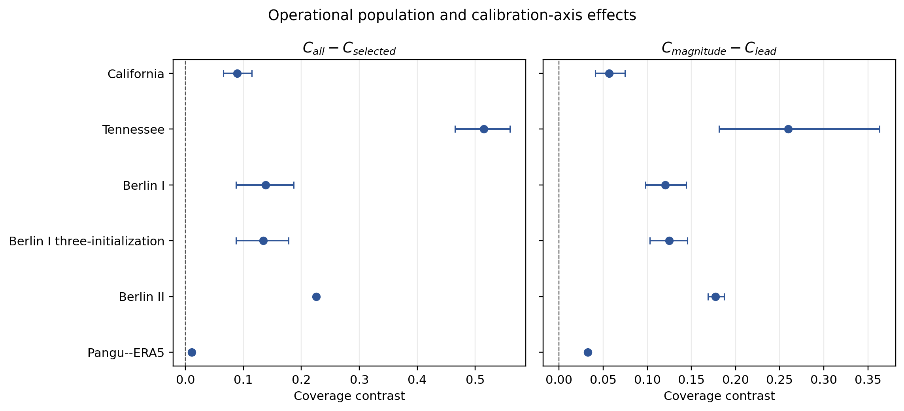
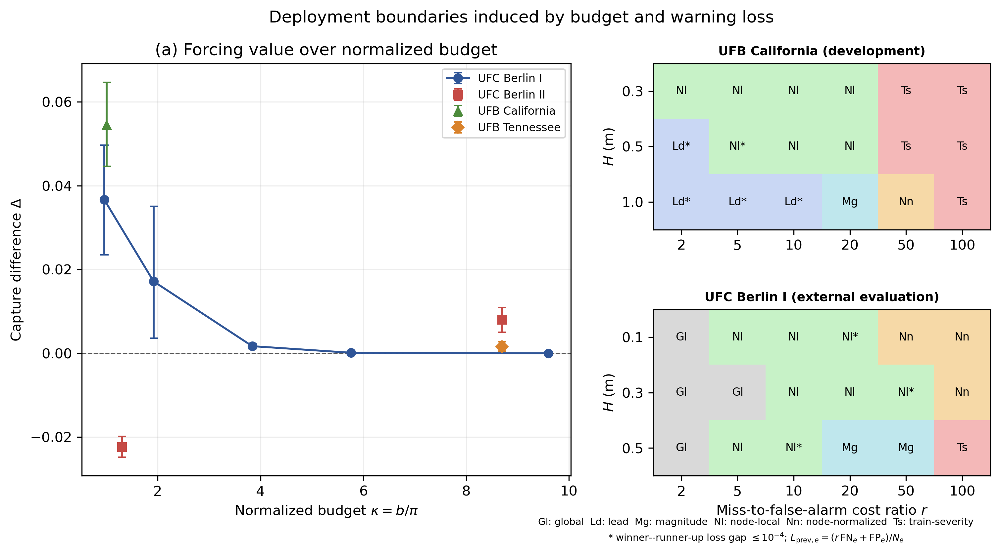

# CANO: Coverage-Aware Neural Operator

[한국어 안내](README.ko.md)

CANO is a coordinate-query neural operator for urban flood field prediction.
The paper's primary contribution is an operational-target reliability protocol:
prespecify the decision population, test it at the event level, respond to the
diagnosed gap, and state the evidence boundary. The CANO comparison is
supporting predictor evidence, and the objective ablation is a
non-confirmatory follow-up. This repository accompanies our IEEE BigData 2026
submission and provides:

- the CANO architecture and its reported configuration;
- a common training and evaluation interface;
- node-normalized target-aligned calibration and event-level evidence APIs;
- adapters to the authors' public DNO-3, FNO3D, and U-Net3D implementations;
- aggregate and event-level results used in the paper;
- central operational-reliability, statistical, and baseline-fairness
  disclosures;
- all 24 development-only HPO candidates and their selection scores;
- an explicit 125-row role ledger bound to the provider's event names and
  archive directories; and
- scripts that rebuild the result tables and figures without accessing the
  original evaluation arrays.

The repository is intentionally compact. Datasets, checkpoints, and bulk
prediction arrays are not redistributed.

## Quick start

```bash
git clone https://github.com/luvpool0811/CANO-BigData2026.git
cd CANO-BigData2026
conda env create -f environment.yml
conda activate cano-bigdata2026
python scripts/quickstart.py --device cpu
python scripts/reproduce_results.py
python scripts/reproduce_inference.py
python scripts/reproduce_operational_evidence.py
python scripts/validate_public_contract.py
```

The first command runs a small synthetic optimization smoke test. The second
rebuilds the public result table and four figures under `results/generated/`.
The third reproduces the six prespecified paired-event comparisons, including
bootstrap confidence intervals, exact sign-flip tests, and Holm adjustment.
The fourth rebuilds the operational-contrast, empirical/CRC calibration,
deployment-boundary, claim-to-evidence, and baseline-fairness tables plus the
central-effect and RQ3/RQ4 figures.
The fifth checks the checkpoint-selection metric, HPO winner calculation,
the checked-in public role ledger, reproduction-level disclosure, and WIS
claim scope. Exact evaluation-data identity and split integrity are verified by
the separate required `--data-root` procedure documented below.
None of these commands downloads a dataset or requires a GPU.

## Primary operational-reliability evidence

The central population and calibration-axis contrasts are checked in as small
archived aggregate reporting summaries. They cover UFB California and Tennessee development,
the prespecified UFC Berlin I evaluation, its three-initialization extension,
the Berlin II deployment boundary, and the prespecified WeatherBench 2
cross-domain test.

<p align="center">
  
</p>

- [`operational_contrasts.csv`](results/paper/operational_contrasts.csv) is the
  source for the plot and the regenerated Fig. 2-style effect table.
- [`operational_evaluation_specification.csv`](results/paper/operational_evaluation_specification.csv)
  gives the complete Berlin I RQ1 row: fixed predictor/archive, population,
  interval rule, calibration/evaluation roles, reporting unit, estimand,
  resampling, and admissible claim.
- [`target_calibration.csv`](results/paper/target_calibration.csv) reproduces
  the four empirical-calibration rows in Table I Panel A.
- [`crc_calibration.csv`](results/paper/crc_calibration.csv) exposes the two
  finite-sample CRC rows in Table I Panel B, including the corrected empirical
  event-risk limit, stored event-bootstrap ACE interval, empty-event estimand,
  and replicate-wise calibrator-refit contract.
- [`deployment_budget_effects.csv`](results/paper/deployment_budget_effects.csv)
  contains the nine budget/prevalence points and stored intervals in Fig. 3(a).
- [`warning_rule_migration.csv`](results/paper/warning_rule_migration.csv)
  contains all 36 Fig. 3(b) cells together with the observed winner loss and
  runner-up gap. It records the exact prevalence-weighted event-macro loss and
  marks display-only near ties at a gap of at most $10^{-4}$. These are
  descriptive event-level rankings, not inferential policy-superiority claims.
- [`claim_evidence.csv`](results/paper/claim_evidence.csv) states the estimand,
  unit, resampling, calibrator treatment, multiplicity family,
  prespecification status, and boundary for every principal claim.
- [`baseline_fairness.csv`](results/paper/baseline_fairness.csv) discloses
  candidate counts, development-only setting selection, seeds, training
  budget, architecture-specific per-update supervision, and checkpoint
  selection.
- [`hpo_candidates.csv`](results/paper/hpo_candidates.csv) discloses all six
  candidate configurations, seed-42 development event-macro physical-H RMSE,
  best epoch, parameter count, and the selected candidate for every system.
- [`reproducibility_scope.csv`](results/paper/reproducibility_scope.csv)
  distinguishes statistic recomputation from archived-summary or aggregate
  regeneration and from code paths requiring provider data or checkpoints.

<p align="center">
  
</p>

### Predictor and evidence hierarchy

| Evidence block | Fixed predictor/system | What the evidence supports |
|---|---|---|
| UFB California/Tennessee | UFB coordinate-query predictor | Development evidence for the operational contrasts |
| UFC RQ1--RQ4 and the corresponding Berlin I Table I rows | Protocol-aligned DNO | Prespecified external operational-reliability evidence |
| WB2 analogous contrasts | Fixed Pangu-Weather forecasts | Cross-domain directional evidence |
| Table II | CANO, DNO-3, FNO3D, and U-Net3D trained under the common protocol | Supporting controlled comparison of independently calibrated complete systems |
| CANO objective ablation | CANO standard, matched-control, and peak-aware objectives | Non-confirmatory same-event follow-up |

The protocol-aligned UFC DNO is not Table II's DNO-3 adaptation, and the
operational RQ values must not be attributed to CANO. Exact predictor identities
and random-seed roles are centralized in
[`docs/PREDICTOR_SEED_CONTRACT.md`](docs/PREDICTOR_SEED_CONTRACT.md).

### Public reproduction boundary

- **Statistic recomputation:** Table II means and the six paired CANO--baseline
  comparisons are recomputed from 48 public event rows.
- **Archived-summary regeneration:** the central UFB/UFC/WB2 contrasts,
  Fig. 2-style plot, Table I Panels A/B, and Fig. 3 deployment boundaries are
  validated and regenerated from archived aggregate reporting summaries; their
  field-array bootstrap and calibrator refits are not rerun.
- **Provider-dependent code path:** paper-scale standard-objective training and
  evaluation require provider data and checkpoints. The compact package does
  not reproduce the protocol-aligned DNO, UFB/WB2 operational analyses, or
  peak-aware training end to end.

This distinction is a public contract, not an implied claim that every paper
statistic is recomputed from redistributed field arrays. The machine-readable
scope is [`reproducibility_scope.csv`](results/paper/reproducibility_scope.csv).

See [`docs/STATISTICAL_DISCLOSURE.md`](docs/STATISTICAL_DISCLOSURE.md) for the
sign-flip assumptions, separate Holm families, and the conditional
interpretation of the WIS bootstrap intervals.

## Reported results

The table contains event-macro averages over 12 BerlinI evaluation events.
NSE and wet-domain NSE are core point-prediction metrics; lower error, target
ACE, and target WIS values are better, whereas higher NSE and CSI values are
better.

| System | Parameters (M) | H RMSE | NSE | Wet NSE | Peak error | Target ACE | Target WIS |
|---|---:|---:|---:|---:|---:|---:|---:|
| **CANO (standard objective)** | **0.277** | **0.0195** | **0.9733** | **0.9716** | 0.3724 | 0.0714 | **0.0121** |
| DNO-3 (standard objective) | 10.815 | 0.0288 | 0.9424 | 0.9369 | 0.2614 | 0.0280 | 0.0219 |
| FNO3D (standard objective) | 10.627 | 0.0294 | 0.9396 | 0.9521 | **0.1864** | **0.0157** | 0.0166 |
| U-Net3D (standard objective) | 5.650 | 0.0380 | 0.8703 | 0.8613 | 0.6357 | 0.0645 | 0.0355 |

<p align="center">
  
</p>

### Non-confirmatory CANO training-objective follow-up

The within-model follow-up compares the standard objective, a selection-matched
control, and the peak-aware trajectory objective under the same evaluation
conditions.

| CANO objective | H RMSE | NSE | Wet RMSE | Wet NSE | Peak error | CSI .01 | CSI .10 | CSI .30 | CSI .50 | Target ACE | Target WIS |
|---|---:|---:|---:|---:|---:|---:|---:|---:|---:|---:|---:|
| Standard objective | 0.0195 | 0.9733 | 0.0236 | 0.9716 | 0.3724 | **0.7640** | 0.8414 | 0.9029 | 0.7678 | 0.0714 | 0.0121 |
| Selection-matched control | 0.0195 | 0.9732 | 0.0237 | 0.9714 | 0.3728 | 0.7638 | 0.8412 | 0.9027 | 0.7677 | 0.0715 | 0.0121 |
| Peak-aware trajectory objective | **0.0164** | **0.9798** | **0.0197** | **0.9795** | **0.0380** | 0.7567 | **0.8541** | **0.9295** | **0.8261** | **0.0428** | **0.0074** |

<p align="center">
  
</p>

The peak-aware trajectory objective reduced CANO's event-macro peak-depth
error from 0.3724 m to 0.0380 m while increasing NSE and wet-domain NSE. The
CSI .01 result illustrates that the objective does not improve every metric.
Because the ablation uses the same 12 evaluation events, confirmation on
independent events and additional urban domains remains necessary.
The aggregate reproduction scope and objective specification are recorded in
[`configs/cano/peak_aware_followup.yaml`](configs/cano/peak_aware_followup.yaml).
The compact public training CLI intentionally supports only the standard
objective; it does not claim end-to-end reproduction of this post-evaluation
follow-up.

The six prespecified paired comparisons are summarized below. All intervals
exclude zero; exact values and adjusted p-values are provided in the
[paired-inference table](results/generated/paired_inference.md).

<p align="center">
  
</p>

Additional public evidence:

- [`results/paper/main_results.csv`](results/paper/main_results.csv): all six
  Table II rows and twelve metrics;
- [`results/paper/event_level_results.csv`](results/paper/event_level_results.csv):
  anonymized event-level results for the four standard-objective systems;
- [`results/generated/main_results.md`](results/generated/main_results.md):
  regenerated full table;
- [`results/generated/paired_inference.md`](results/generated/paired_inference.md):
  effect sizes, 95% paired-bootstrap intervals, raw exact sign-flip p-values,
  and Holm-adjusted p-values for the six primary comparisons; and
- [`results/generated/`](results/generated/): point-prediction, uncertainty,
  event-level, and training-objective plots.

## Data

The experiments use the Berlin I portion of the
[UrbanFloodCast dataset](https://doi.org/10.5281/zenodo.15700880). The original
dataset release contains 125 design-storm events for each of two Berlin areas
and is accompanied by the authors' [UrbanFloodCast source
repository](https://github.com/HydroPML/UrbanFloodCast).

Download the data from its original provider and follow
[`docs/DATASETS.md`](docs/DATASETS.md) to create the compact NPZ interface used
by these scripts. Data are never downloaded automatically.

## Train CANO

Each prepared event is one NPZ file. Training and validation statistics must be
derived from training data only.

```bash
python scripts/train.py \
  --config configs/cano/standard.yaml \
  --data-root /path/to/prepared/berlin-i \
  --output-dir outputs/cano/seed-42 \
  --seed 42 \
  --device cuda
```

Evaluate a checkpoint:

```bash
python scripts/evaluate.py \
  --checkpoint outputs/cano/seed-42/best.pt \
  --data-root /path/to/prepared/berlin-i \
  --split test \
  --normalization /path/to/prepared/berlin-i/normalization.json \
  --output outputs/cano/seed-42/test_metrics.json \
  --device cuda
```

The calibration configuration is
[`configs/calibration/target_aligned.yaml`](configs/calibration/target_aligned.yaml).
Fit the node scale on development events, fit the event-balanced normalized
residual quantiles on separate calibration events, and only then evaluate held
out events. The public functions are `fit_node_scale`,
`fit_target_aligned_calibrator`, and `evaluate_event`.
For finite-sample CRC, `crc_maximum_empirical_event_risk` exposes the bounded
event-loss correction and `fit_event_balanced_crc` fits the corresponding
event-balanced residual threshold. The checked-in CRC table remains an
explicit archived-summary regeneration because provider field arrays are not
redistributed.

The training loss remains each architecture's native normalized MSE. All four
public training configurations nevertheless select checkpoints by the same
deterministic criterion used for the reported comparison: the mean physical-H
RMSE across all development events, all 24 leads, and every valid cell. The
criterion is recorded as `development_event_macro_physical_h_rmse` in each
checkpoint and training summary.

Evaluation-data identity and split integrity are verified as a separate,
required procedure for a paper-scale run. It compares all 125 prepared
identities with the public
85/15/13/12 role ledger while opening only `event_id`,
`provider_event_name`, and `provider_relative_path` metadata—not `input`,
`target`, or `mask`:

```bash
python scripts/validate_public_contract.py \
  --data-root /path/to/prepared/berlin-i \
  --write-data-integrity-record outputs/data-integrity-verification.json
```

After this check passes, execute the full public evidence chain from three
frozen checkpoints:

```bash
python scripts/run_evidence_pipeline.py \
  --checkpoints outputs/cano/seed-7/best.pt \
                outputs/cano/seed-31/best.pt \
                outputs/cano/seed-42/best.pt \
  --data-root /path/to/prepared/berlin-i \
  --normalization /path/to/prepared/berlin-i/normalization.json \
  --data-integrity-record outputs/data-integrity-verification.json \
  --role-config configs/evaluation/berlin_i_roles.yaml \
  --calibration-config configs/calibration/target_aligned.yaml \
  --output outputs/cano/evidence.json \
  --device cuda
```

The pipeline fails before model evaluation unless the data-integrity
verification record binds the current
data-root path, all 125 identity metadata records, the role configuration, and
the provider ledger. The resulting evidence record also binds that verification record,
normalization, calibration configuration, and three checkpoint hashes.

This command averages the three seed predictions in physical units, fits the
node scale on 15 development events, fits calibration on 13 separate events,
and evaluates 12 held-out events exactly once. The role contract also records
85 training events. It revalidates the data-integrity record against current identity
metadata before reading field arrays, then rejects duplicate event identities
within or across development, calibration, and evaluation roles. The evidence
record contains only public aliases, namespaced event-ID digests, and input
binding hashes. Dataset files remain provider-managed and are not bundled.

Each NPZ must carry the `provider_event_name` and `provider_relative_path`
metadata declared by
[`berlin_i_role_membership.csv`](configs/evaluation/berlin_i_role_membership.csv).
The data-integrity verification compares all 125 identities exactly. If the
original provider ZIP is available, its central directory can additionally be
checked directly—without opening payload members—with:

```bash
python scripts/validate_public_contract.py \
  --provider-archive /path/to/UrbanFloodCast_Dataset.zip
```

## Run an external baseline

The upstream model code is not copied into this repository. Clone the authors'
repository and check out the revision used by the adapters:

```bash
git clone https://github.com/HydroPML/UrbanFloodCast.git external/UrbanFloodCast
git -C external/UrbanFloodCast checkout f08846a1d0ed5a82d9241d2229df8ec8997ebfd5

python scripts/train.py \
  --config configs/baselines/dno3.yaml \
  --data-root /path/to/prepared/berlin-i \
  --upstream-source external/UrbanFloodCast \
  --output-dir outputs/dno3/seed-42 \
  --seed 42 \
  --device cuda
```

Replace the configuration with `fno3d.yaml` or `unet3d.yaml` for the other
models. The adapter verifies the upstream revision, preserves the authors'
architecture classes, and maps all models to the same 31-channel input and
72-channel output contract. See
[`docs/BASELINE_ADAPTATION.md`](docs/BASELINE_ADAPTATION.md) and the regenerated
[`baseline fairness table`](results/generated/baseline_fairness.md).

The shared fairness budget means six candidates, seeds 7/31/42, 100 epochs per
seed, and 12,900 optimizer updates. It does not claim identical label exposure
per update: CANO samples one lead and at most 4,096 query coordinates, whereas
the grid baselines use their native dense 24-lead H/U/V field supervision.

Target WIS is a complete-system operational-risk comparison. Each model is
evaluated on its own prediction-selected population and with its own
development/calibration fit; it is not a common-population or
architecture-only causal contrast.

## Repository layout

```text
configs/                  reported model and training configurations
docs/                     dataset and reproducibility guides
results/paper/            checked-in aggregate and event-level results
results/generated/        regenerated tables and figures
scripts/                  direct train, evaluate, and reproduction commands
src/cano_bigdata2026/     CANO, adapters, data contract, and metrics
tests/                    fast unit and integration tests
```

## Validation

The lightweight release check is deliberately short:

```bash
python -m pytest -q
python scripts/quickstart.py --device cpu
python scripts/reproduce_results.py
python scripts/reproduce_inference.py
python scripts/reproduce_operational_evidence.py
python scripts/validate_public_contract.py
```

It checks model dimensions, the exact CANO parameter count, adapter tensor
mapping, metric calculations, paired inference, role identity separation,
operational disclosure regeneration, the complete three-checkpoint
evidence workflow on synthetic data, CLI behavior, and regeneration of the
public results. It also verifies the HPO winner and public split membership.
It does not rerun expensive training or open bulk evaluation
arrays.

## Citation

Please cite the accompanying paper. Bibliographic metadata will be updated
after publication; the current software citation is available in
[`CITATION.cff`](CITATION.cff).

## License and third-party material

The original code in this repository is released under the [MIT
License](LICENSE). UrbanFloodCast code and datasets are external materials and
are not covered by this license. Consult their original pages for the
applicable terms before use; see [`THIRD_PARTY.md`](THIRD_PARTY.md).
